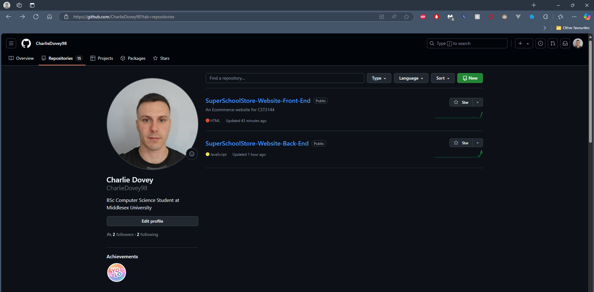
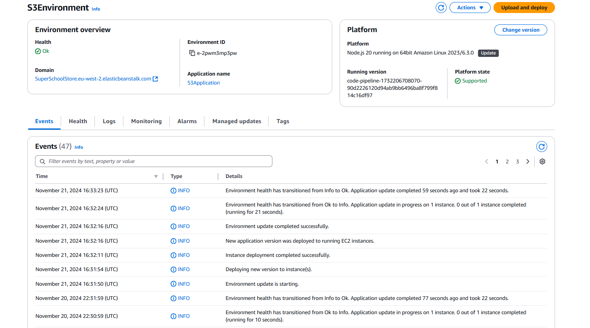
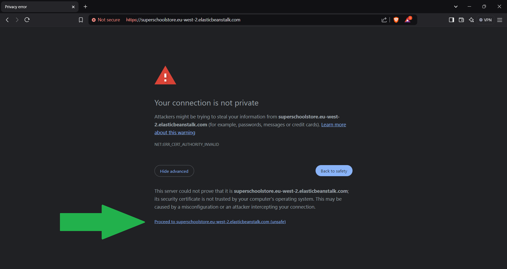
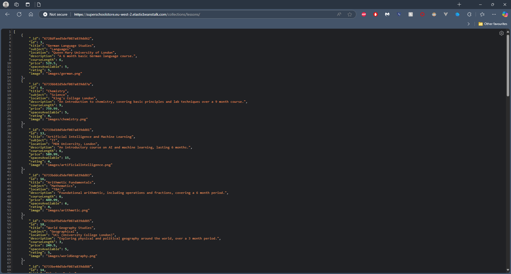
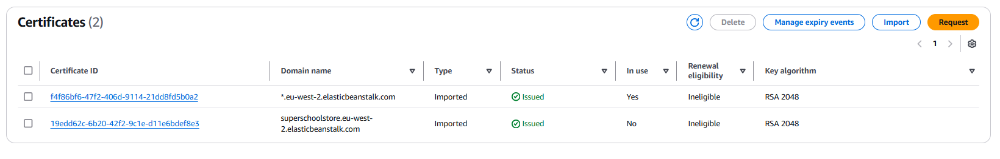
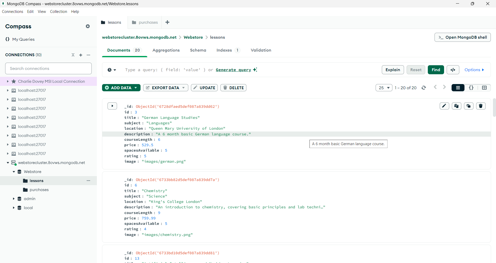
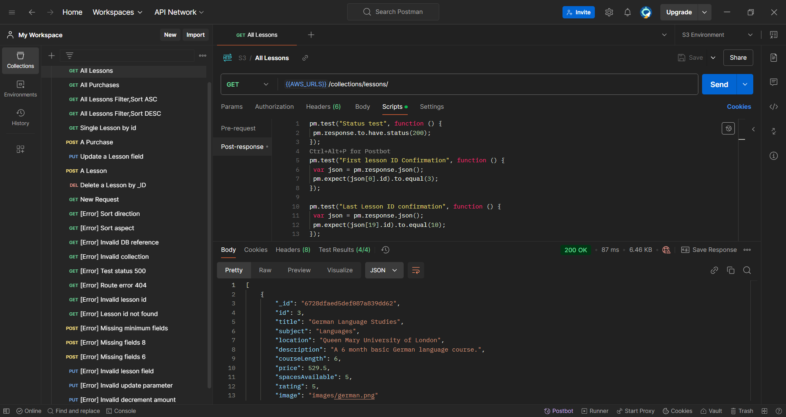

# Super School Store S3 Ecommerce Website.  
- The back end repository for SuperSchoolStore.  
- Created for CST3144.  
- Charlie Dovey M00843428.  

## Project Links/ Information  

*Github Back-End Repository Link*: https://github.com/CharlieDovey98/SuperSchoolStore-Website-Back-End  
*Github Front-End Repository Link*: https://github.com/CharlieDovey98/SuperSchoolStore-Website-Front-End  
  

*Website Images attained from*: https://www.flaticon.com  

*Server hosted using AWS Elastic Beanstalk*: https://superschoolstore.eu-west-2.elasticbeanstalk.com/  
  
*Ensure security check is accepted to enable the page will work, via visiting*:  
  

*Get request example, GET all lessons in the database*:  
https://superschoolstore.eu-west-2.elasticbeanstalk.com/collections/lessons  
  

*HTTPS SSL/TSL Certificates located in: /certificates created, self-signed and uplaoded to AWS Certificate Manager for use in this project.*  
  

*MongoDB used as the Database storing information on Lessons, Purchases of the site.*  
  

*Postman used for testing API endpoints during development.*  
  

